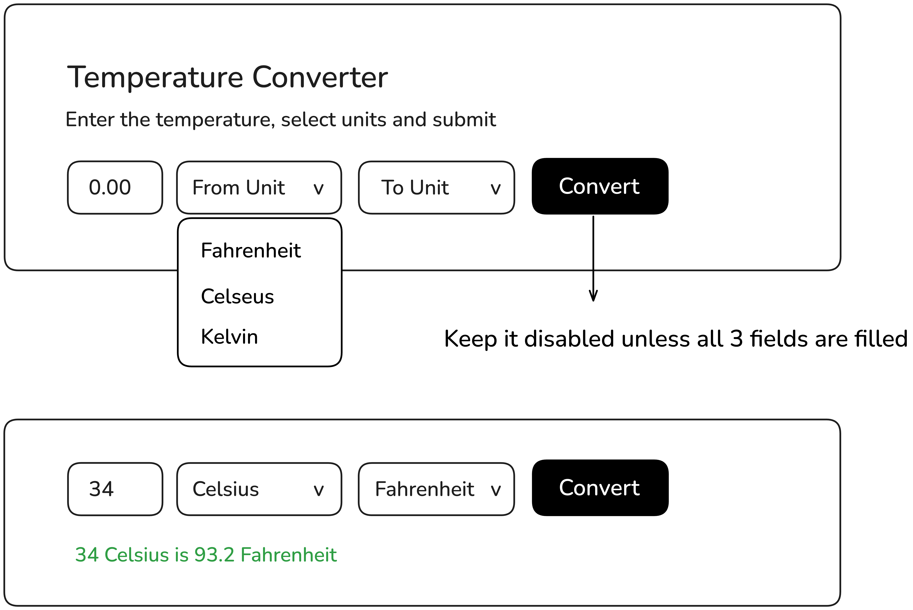

# Temperature Converter



## Project URL

You can view the project documentation and details at [Temperature Converter](https://roadmap.sh/projects/temperature-converter).

## Features

- Converts temperatures between Celsius, Fahrenheit, and Kelvin.
- Disables the "Convert" button until all required fields are filled.
- Displays the converted temperature in a clear, easy-to-read format.

## Demo

View a live demo of this project [here](https://roadmap.sh/projects/temperature-converter).

## Project Structure

```bash
Temperature_Converter/
├── index.html          # Main HTML file
├── CSS/
│   └── style.css       # Styles for the temperature converter
├── Image/
│   └── mockup.png      # Image mockup of the converter
├── JS/
│   └── script.js       # JavaScript for temperature conversion logic
└── README.md           # Project documentation        # Project documentation
```

# Installation

1. Clone the repository:

```bash
git clone https://github.com/aviralSri23455/Temperature_Converter.git

```

2. Navigate to the project folder:

```bash
cd Temperature_Converter

```

3. Open **index.html** in your browser to use the temperature converter.

# Usage
- Enter a temperature value in the input field.
- Select the "From" unit (Celsius, Fahrenheit, or Kelvin).
- Select the "To" unit.
- Click the "Convert" button to view the converted temperature.
